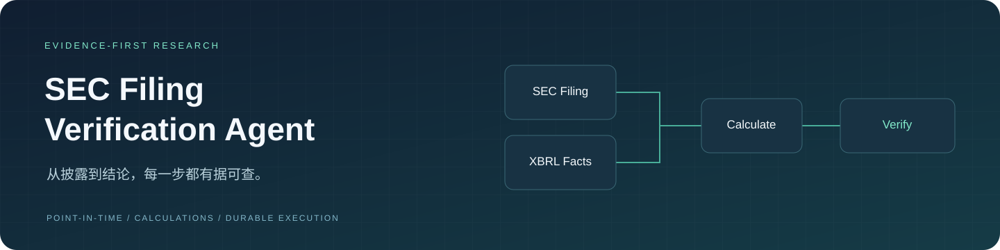
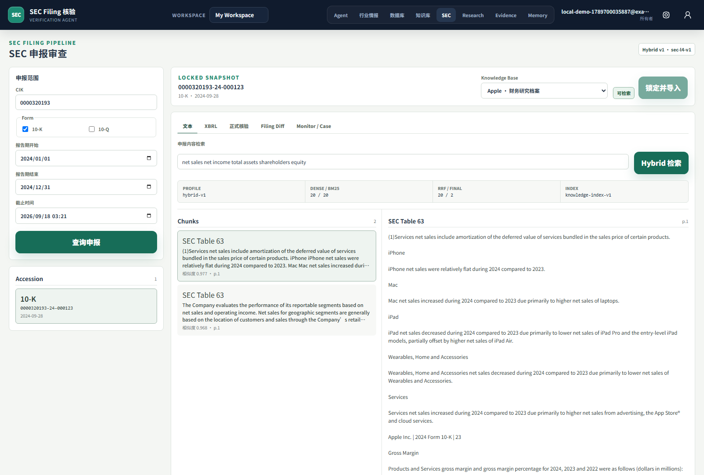
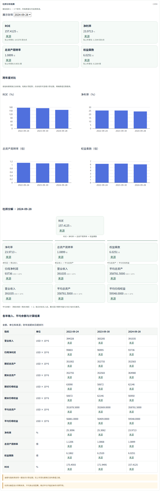
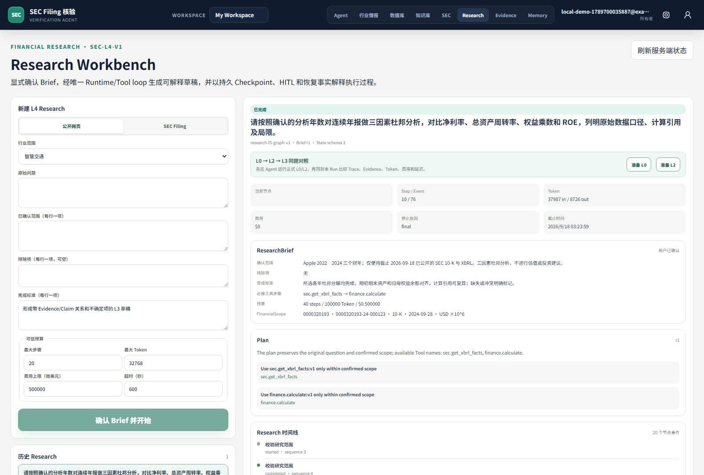
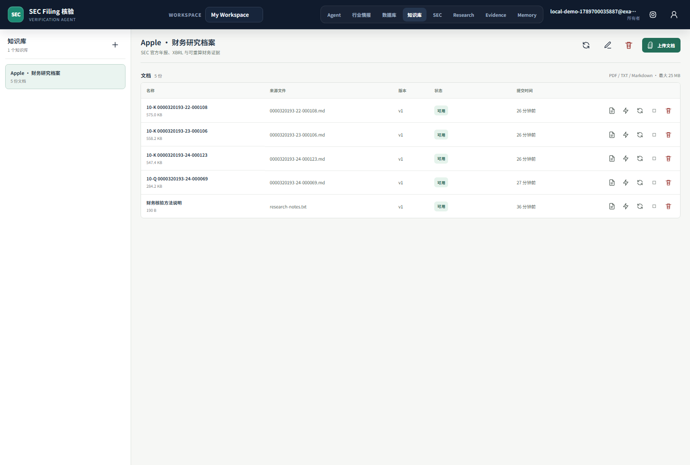
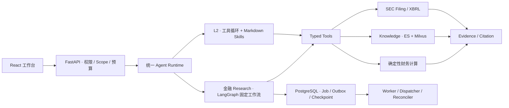

<div align="center">



# SEC Filing Verification Agent

**面向中文财务研究的 SEC 披露检索、事实核验与可恢复 Agent**

锁定申报范围 · 追溯原始证据 · 重算财务指标 · 可中断恢复

[快速部署](#快速部署) · [实际界面](#实际界面) · [架构设计](docs/architecture.md) · [验证记录](#验证与边界)

[](https://github.com/hrw991009/sec-filing-verification-agent/actions/workflows/ci.yml)


</div>

## 它解决什么问题

财务研究不能只得到一段“看起来合理”的回答，还需要知道：**数字来自哪份披露、对应什么期间、怎么算出来，以及任务失败后能否继续。**

项目将 SEC Filing、XBRL、私有知识库、确定性计算和证据核验放在同一条执行链中。模型负责研究与工具选择；服务端负责范围、权限、预算和执行状态；计算器负责财务运算。

| 研究需求 | 系统能力 |
| --- | --- |
| 截止某一时点，哪些披露可以使用？ | CIK / Form / accession / 报告期 / `as_of` 锁定与不可变来源快照 |
| 一个财务数字是否有据可查？ | XBRL 与 Filing 混合检索，Claim → Evidence → 原文、单元格或计算引用 |
| ROE 为什么发生变化？ | 3–5 年杜邦分析：净利率、资产周转率、权益乘数及 ROE，可重算输入与平均余额 |
| 复杂研究如何稳定执行？ | 固定金融 Research 工作流、节点 Checkpoint、Job/Outbox、租约与恢复对账 |
| 日常问答是否必须启动完整研究？ | L2 工具循环按需加载 Markdown 轻量技能；复杂研究使用独立固定工作流 |

## 实际界面

以下是本机 Docker 完整应用的真实浏览器截图，不是 UI 设计稿。数据来源与复现步骤见[截图记录](docs/assets/screenshots/README.md)。

### SEC 披露工作台

按公司、申报类型与截止时间选定年报，锁定范围后导入私有知识库。



### 多年度杜邦分析

指标卡、同比变化、跨年柱状图、杜邦分解图与数据表共用同一份服务端计算结果，不另造前端数字。



### Research 与知识库

| 可追踪的研究工作台 | 私有知识库 |
| --- | --- |
|  |  |

## 快速部署

**只需要 Git 和 Docker Desktop（Linux containers）。** 首次构建会下载镜像与依赖；不要求本机安装 Python、Node.js 或数据库。

```powershell
git clone https://github.com/hrw991009/sec-filing-verification-agent.git
cd sec-filing-verification-agent
.\start-local.ps1
```

打开 **https://localhost:8443**，创建本地账户即可进入工作台。首次访问会提示本地自签名证书；确认地址确实为 localhost 后继续访问。

Linux / macOS：`bash start-local.sh`。

启动脚本会构建前后端镜像、生成独立随机密钥与本地证书、初始化私有桶、执行数据库迁移，并启动 API、Worker、Dispatcher、Reconciler、Beat 和检索依赖。仅网关的 `127.0.0.1:8443` 对宿主机开放。

### 配置真实研究

首次启动后编辑 **`.data/local/provider.env`**：

- 模型：`AGENT_MODEL_PROVIDER_BASE_URL`、`AGENT_MODEL_PROVIDER_API_KEY`、`AGENT_MODEL_ROUTE_JSON`。
- SEC 身份：`SEC_USER_AGENT_APP`、`SEC_USER_AGENT_EMAIL`，使用真实可联系邮箱。

保存后运行 `.\start-local.ps1 -NoBuild`。已有本项目的 `.env`，也可显式导入模型及 SEC 身份配置：

```powershell
.\start-local.ps1 -ImportEnv .env
```

导入不会复制旧数据库密码或覆盖原文件。未配置模型时，页面和账户仍可使用，Agent 请求会明确失败，不会静默返回假回答。配置示例、资源建议与排错见[部署指南](docs/deployment.md)。

### 日常操作

```powershell
.\start-local.ps1 -Action status     # 查看服务
.\start-local.ps1 -Action logs       # 查看应用日志
.\start-local.ps1 -Action stop       # 停止，保留数据
.\start-local.ps1 -NoBuild           # 再次启动
```

账户、文档和任务保存在独立 Docker volumes；密钥保存在 `.data/local/`。**不要删除配置目录或执行 `down --volumes` 来重启应用。**

## 核心设计



- **单一事实源**：PostgreSQL 保存业务事实；Elasticsearch / Milvus 是可重建索引。
- **服务端可信边界**：Workspace、申报身份、时间截点、工具参数和预算不由模型自行决定。
- **可复核数字**：保存输入 Evidence、单位、scale、公式和舍入规则。
- **恢复与业务解耦**：Runtime 管理执行可靠性；工作流组织研究步骤；结果层消费正式报告与计算证据。
- **明确不确定性**：区分 `verified`、`partial`、`conflict`、`insufficient_evidence`，缺数据时不补造。

<details>
<summary>技术栈与目录</summary>

| 层次 | 技术 |
| --- | --- |
| API 与领域模型 | Python 3.13 / FastAPI / Pydantic / SQLAlchemy / Alembic |
| Agent 与工作流 | 统一 Runtime / Typed Tool Registry / LangGraph |
| 前端 | React / TypeScript / Vite / ECharts |
| 异步与存储 | Celery / Redis / PostgreSQL / MinIO |
| 检索 | Elasticsearch / Milvus |
| 质量 | pytest / Vitest / Playwright / Ruff / mypy / ESLint / Semgrep / Gitleaks |

```text
apps/backend/          API、领域模块、Runtime、Worker、迁移和测试
apps/web/              React 工作台与结果展示
packages/api-contract/ OpenAPI 与 TypeScript 契约
infra/local/           完整应用 Compose、网关、配置初始化与浏览器验证
evals/                 版本化场景、观察、Scorer 与报告
docs/                  架构、ADR、部署指南与工程验证记录
```

</details>

## 验证与边界

| 证据 | 如何查看 |
| --- | --- |
| 当前产品固定场景的 50 次稳定性验证 | [稳定性实测报告](evals/reports/product-stability-v1.md) |
| 隔离恢复与不可变镜像回滚 | [工程验收 Runbook](docs/runbooks/sec-release-acceptance.md) |
| 完整 Docker 部署与真实浏览器 | [本次部署验证记录](docs/local-deployment-validation.md) |
| 冻结发布要求与未满足的外部门槛 | [发布就绪报告](evals/reports/sec-release-readiness-v1.md) |

这是可本机部署的工程项目，不等于已经完成生产部署或投资业务验证。模型可用性、源站限制、基准许可和完整发布治理分别记录，不用截图或单次成功覆盖。

<details>
<summary>正式发布门禁</summary>

当前发布判定仍为
`NO_GO`，因此不得创建
`v0.2.0-sec-disclosure-verifier` 标签、发布镜像，或对外宣称已经完成生产验证。

这里的“发布镜像”指正式版本发行；本指南构建的 `:local` 镜像用于本机运行，不是公共发行镜像。局部稳定性与恢复验收通过，不自动改变完整发布判定。

</details>

## 深入了解

- [部署与排错](docs/deployment.md) · [源码开发](docs/development.md)
- [架构与 ADR](docs/architecture.md) · [工程设计基线](docs/engineering-baseline.md)
- [杜邦分析](docs/sec-dupont-workflow.md) · [L2 轻量技能](docs/l2-instruction-skills.md)
- [检索与计算](docs/sec-retrieval-design.md) · [核验与恢复](docs/sec-verification-monitor-design.md)
- [评测设计](docs/sec-agent-evaluation.md) · [第三方依赖与许可证](docs/security/third-party-notices.md)

> 不提供投资建议、目标价、交易动作或审计意见。不要提交 `.env`、API Key、私钥、会话文件或数据库备份。
