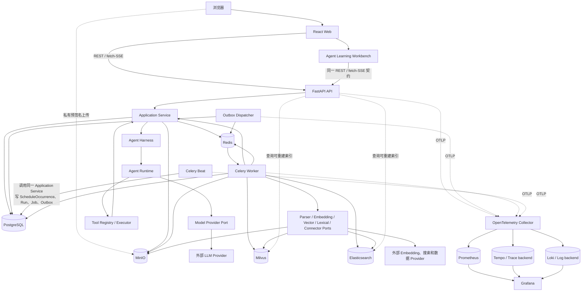

# 系统架构说明

> 计划编号：`IIP-MASTER-001`
>
> 文档状态：已接受
>
> 更新日期：2026-08-12
>
> 权威来源：`docs/master-plan.md` 1.7.0

## 1. 架构目标

系统采用模块化单体作为七天版本的业务形态，同时使用独立 Celery Worker 和 Celery Beat Scheduler 执行异步任务。该形态必须承载能力矩阵从两个参考项目映射出的全部目标能力，不能成为只支持演示路径的一次性脚手架。

架构需要同时满足：

- PostgreSQL 作为唯一业务事实源；
- 严格 Workspace 租户隔离；
- 私有对象存储；
- 可恢复异步任务；
- 可重建向量和关键词索引；
- 普通回答、Tool Use 与 Deep Research 共用统一 Agent Runtime；
- Agent Harness 与 Evaluation Harness 复用同一生产执行语义；
- 统一 Evidence 与 Citation；
- 可替换外部 Provider；
- 可恢复流式聊天与 Research；
- 由正式 Event、Trace 与 Manifest 驱动的 Agent Learning Workbench；
- 清晰模块边界；
- 完整测试、安全和可观测门禁。

第一周不引入微服务、Kubernetes、Neo4j 或第二套正式业务链路。这是七天架构选择，不会削减七天目标能力，也不允许以“先做基础版本”为理由牺牲数据模型、安全边界、测试或可演进性。

### 1.1 七天能力与成熟度边界

七天阶段交付 `v0.1.0-agent-learning-foundation`。它必须高质量完成能力矩阵从两个参考项目映射出的全部目标能力，并打通规定的完整用户路径，但不宣称已经达到生产级成熟度。

这里必须区分“能力广度”和“实现质量”：

- 冻结范围可以预先限制输入种类、Provider 数量、数据规模或高级配置，但范围内必须使用正式数据模型、真实链路、权限、错误语义、恢复机制和自动化测试；
- `thin_slice`、`contract_only`、`blocked` 和 `planned` 只记录开发过程；到 Day 7，矩阵中的每个目标都必须在其冻结范围内达到 `complete`；
- 任何被列为七天目标的能力都不能因工期被静默删除，也不能通过 Mock、硬编码或第二套临时链路假装完成。

模块化单体不是“低配版本”，而是七天内同时保证交付速度、边界清晰和质量门禁的正式架构选择。生产级成熟度不属于本次七天验收；本文只定义支撑 Day 1～Day 7 目标所需的架构。

### 1.2 质量属性与架构响应

| 质量属性 | 架构保证 | 主要验收证据 |
|---|---|---|
| 能力完整性 | `docs/feature-matrix.md` 逐项映射两个参考项目形成的全部目标能力；每项绑定 Day 1～Day 7 的任务、测试和门禁 | 七天目标无遗漏，全部达到各自冻结的验收深度并通过全局 Definition of Done |
| 正确性与一致性 | PostgreSQL 单一事实源；Outbox、幂等、补偿、对账和可重建索引 | 约束/并发测试、重复投递测试、部分故障与索引重建演练 |
| 安全与隐私 | WorkspaceScope、服务端 membership 授权、私有对象、短期凭据、不可信输入边界 | 跨租户泄漏为 0；威胁建模、负向测试、密钥与依赖扫描 |
| 可靠性与恢复 | 持久 Job/Checkpoint、阶段状态、重试上限、取消、备份与回滚 | Worker/存储/Provider 故障演练；备份—删除—恢复和上一镜像回退 |
| 性能、容量与成本 | 分段计时、异步长任务、预算、限流、背压和可替换 Provider | 七天可重复的 API/Job/RAG/Research 基准，p50/p95/p99、吞吐、积压、Token 与费用报告 |
| AI 与证据质量 | 统一 Evidence/Citation、RAG 回归集、Claim 核验和明确拒答 | Citation 可解析率 100%；RAG 基线回归、忠实度、拒答和人工抽检 |
| 可观测与审计 | 结构化日志、指标、Trace、统一关联 ID 和审计事件 | 端到端链路可追踪；关键错误率、延迟、队列、Provider 和一致性告警可验证 |
| 可维护与可演进 | Router/Service/Repository/Port 分层、版本化 OpenAPI/SSE、Adapter 隔离 | 架构依赖检查、契约测试、migration 与兼容/回滚演练 |
| 可部署与可操作 | 锁文件、可复现构建、fresh migration、healthcheck、资源限制和优雅关闭 | 干净环境启动、本地/预发布 Compose、CI 全绿、Runbook 演练、漏洞和镜像扫描 |
| 可使用性 | 统一 loading/empty/error/forbidden/retry/cancelled/partial 状态和语义化交互 | 关键组件测试、键盘操作检查和真实浏览器 E2E |

主计划没有可以支撑生产级容量承诺的真实流量数据，因此本文不伪造可用性或吞吐数字。七天内必须建立可重复基线、记录 p50/p95/p99、错误率、吞吐、积压、Token 和费用，并验证预算与限制真实生效。未经测量的“性能很好”不能作为七天验收结论。

## 2. 总体架构



### 2.1 固定技术栈与职责

| 层 | 七天版本选择 | 主要职责 |
|---|---|---|
| Web | React、TypeScript、Vite、React Router | 页面、路由和浏览器入口 |
| 服务端状态 | TanStack Query | API 缓存、请求状态、失效和重试；不保存长期凭据 |
| 本地 UI 状态 | Zustand | 当前行业、短期界面偏好和不属于服务端事实的状态 |
| UI 与图表 | Ant Design、ECharts | 统一交互组件和经过 Schema 校验的图表展示 |
| 安全文本渲染 | react-markdown、rehype-sanitize | Markdown 解析与消毒；不直接执行模型 HTML/JS |
| API | FastAPI、Pydantic | REST/SSE、输入输出校验、依赖注入和 OpenAPI |
| 持久化 | PostgreSQL、SQLAlchemy、Alembic | 业务事实、事务、约束和版本化迁移 |
| 异步执行 | Celery、Redis、Celery Beat、Outbox Dispatcher | 至少一次任务投递、定时调度、短期事件和可靠发布 |
| 私有资产 | MinIO | 原文件、快照、图片、表格、页面和查询结果对象 |
| 检索 | Milvus、Elasticsearch、RRF、可插拔 Reranker | Dense、BM25、融合、重排和调试排名 |
| SQL 安全 | sqlglot | 完整 AST 解析、allowlist 和危险语句拒绝 |
| Agent Runtime | 项目内统一执行层 | Run/Step/Event/State/Budget、model/tool loop、取消、终止、Checkpoint 与 Trace |
| Agent Harness | 项目内组合层 | Instructions、Context Compiler、Tool/Skill、Memory、Knowledge/RAG、Approval、Artifact 与 Eval hook |
| Evaluation Harness | 复用正式 Runtime/Harness | Scenario、Fake/Replay、Fault injection、Scorer、消融与回归报告 |
| Research | LangGraph | 仅承载 Deep Research typed graph 与 Checkpoint |
| 测试 | pytest、HTTPX、Testcontainers、Vitest、RTL、MSW、Playwright | 单元、组件、真实依赖、契约和关键浏览器旅程 |
| 可观测 | JSON 日志、OpenTelemetry、Prometheus；Grafana/Tempo/Loki profile | 关联日志、指标、Trace、仪表盘和告警验证 |

同一职责只能有一套正式库和一条正式链路。替换上表中的选择属于架构变化，必须更新 ADR、迁移和回滚说明。

## 3. 运行时组件职责

| 组件 | 主要职责 | 不负责什么 |
|---|---|---|
| React Web | 页面、路由、短期 UI 状态、服务端状态展示和 SSE 消费 | 不保存服务端业务事实，不持有供应商密钥 |
| FastAPI API | 身份、权限、参数校验、事务、REST/SSE 契约和创建 Job | 不在请求中同步执行 OCR、Embedding、索引或 Research |
| Application Service | 业务用例、WorkspaceScope、事务、Job/Outbox 原子创建和领域 Port 编排 | 不实现第二套 model/tool loop，不把 Router 或 Worker 当业务事实源 |
| Agent Runtime | 统一推进 AgentRun/Step、typed State、model/tool loop、Event、Budget、取消、终止、Checkpoint 与 Trace | 不拥有业务权限规则，不直接依赖具体 Provider SDK、Router 或前端 |
| Agent Harness | 组合可信 Instructions、Context、Tool/Skill、Memory、Knowledge/RAG、Guardrail、Approval、Artifact 与 Eval hook | 不另写生产执行器，不绕过 Runtime 调用模型或 Tool |
| Evaluation Harness | 用同一 Runtime/Harness 执行 Scenario、Fake/Replay、Fault 与 Scorer | 不修改线上回答路径，不把 Fake 或 LLM judge 当真实质量证据 |
| Outbox Dispatcher | 抢占 PostgreSQL Outbox、至少一次发布 Celery 消息、退避和持久 dead-letter | 不执行业务任务，不把“发布一次”当作可靠性保证 |
| Celery Worker | 调用正式 Application Service/Agent Runtime 承载文档解析、Embedding、索引、Agent Run、Research、采集和评测 | 不建立第二套业务 Service，不直接实现 model/tool 决策循环 |
| Celery Beat | 计算到期计划，并调用与 API 相同的 Application Service；在单个 PostgreSQL 事务中幂等创建 ScheduleOccurrence、业务 Run、Job 和 Outbox | 不直接向 Redis/Celery 发布任务，不直接保存执行结果，不建立第二套调度业务逻辑 |
| PostgreSQL | 用户、Workspace、业务资源、Job、Evidence 和最终状态 | 不承担大文件存储 |
| Redis | Celery 队列、限流、缓存和短期流事件 | 不是业务事实源 |
| MinIO | 私有文件、图片、表格和页面资产 | 不负责业务权限和资源所有权 |
| Milvus | 可重建 Dense 向量索引 | 不作为权限或业务状态最终来源 |
| Elasticsearch | 可重建 BM25 关键词索引 | 不作为权限或业务状态最终来源 |
| 外部 Provider | LLM、Embedding、搜索和行业数据等具体能力 | 不得直接进入领域模块 |
| OpenTelemetry Collector | 接收 API/Dispatcher/Worker/Beat 的脱敏 Trace、指标和日志信号 | 不保存业务事实或敏感原文 |
| Prometheus/Grafana/Tempo/Loki | 七天可重复基线、链路排障、仪表盘和告警演练 | 不代替业务审计和 PostgreSQL 状态 |

业务 Job 状态和最终结果必须保存在 PostgreSQL，不能以 Celery result backend 为准。

## 4. Monorepo 与模块边界

后端正式入口为 `apps/backend/src/industry_platform`，不能再建立 `backend/app` 或 `backend/service` 等第二套入口。

仓库职责固定如下：

```text
apps/backend/                 FastAPI、业务模块、Port/Adapter、Worker、迁移与后端测试
apps/web/                     app、routes、features、entities、shared
packages/api-contract/        从 OpenAPI 生成的 TypeScript 契约，禁止手改
tests/e2e/                    关键真实浏览器旅程
tests/integration/            跨模块和真实依赖集成测试
tests/evaluation/             RAG、Citation、Agent 和性能验收入口
evals/datasets/               版本化黄金题与夹具
evals/reports/                可重现的 JSON/Markdown 评测报告
infra/compose/                本地/预发布 Compose
infra/docker/                 镜像与入口脚本
infra/observability/          Collector、Prometheus 和可选可视化 profile
docs/adr/                     已接受架构决策
docs/learning-log/            学习者自己的复盘
docs/runbooks/                启动、故障、恢复和回滚步骤
scripts/                      生成、检查、对账和运维命令入口
```

主要业务模块包括：

- `identity`；
- `agent_runtime`；
- `agent_harness`；
- `files`；
- `knowledge`；
- `ingestion`；
- `retrieval`；
- `context`；
- `evidence`；
- `conversation`；
- `memory`；
- `tools`；
- `research`；
- `industry`；
- `data_explorer`；
- `jobs`；
- `evaluation`。

模块内部根据真实需要使用 `models.py`、`schemas.py`、`repository.py`、`service.py`、`router.py`、`events.py`，需要异步执行时再增加 `tasks.py`。

不得为了匹配目录图生成空文件，也不得形成千行万能 Service。

## 5. 依赖方向

```text
identity ← 全部租户模块
files ← knowledge / conversation / evidence
knowledge ← ingestion / jobs / parser ports
retrieval ← knowledge / vector / lexical / evidence
agent_runtime → model/tool/checkpoint/trajectory ports / jobs / evidence
agent_harness → agent_runtime / context / tools / memory / knowledge / retrieval / approval / evaluation ports
conversation → agent_harness / evidence
research → agent_harness / retrieval / industry / data_explorer / evidence
industry ← jobs / evidence / connector ports
evaluation → agent_harness；只读观察 agent_runtime / conversation / retrieval / research
```

必须遵守：

- Router 只调用 Application Service；
- Service 通过 Repository 或 Port 工作；
- Worker 复用相同 Service；
- Provider SDK 只能出现在 `adapters/`；
- 普通回答、Tool Use 和 Research 只能通过同一个 `AgentRuntime.run` 推进；
- Harness 只组合 Runtime、Context、Tool、Memory、Knowledge/RAG、Approval 和 Eval hook，不实现第二套 loop；
- `research` 不得导入具体 Milvus、Elasticsearch 或 MinIO SDK；
- `research` 和 `conversation` 不得导入具体 Model Provider SDK，也不得直接调用 Provider Adapter；
- LangGraph 节点调用统一 Runtime 或 Domain Port，不复制 Application Service、ToolExecutor 或 model/tool loop；
- `conversation` 不得导入 Router；
- `evaluation` 不得参与线上回答；
- 每个 HTTP 请求、Celery task 和并发协程拥有独立 SQLAlchemy Session；
- 不得跨请求或跨 task 共享 AsyncSession。

## 6. 数据所有权

### 6.1 PostgreSQL

PostgreSQL 是唯一业务事实源，保存用户和 Workspace、membership、Refresh Session、审计日志、文件和知识库元数据、文档版本、Chunk 和资产关系、会话和消息、Job 和 Outbox、Evidence 和 Citation、Memory、Research 状态、行业数据以及 Text2SQL Query Run。

### 6.2 MinIO

MinIO 保存私有二进制资产。数据库只保存 bucket 和 object key，不保存长期公开 URL。

读取对象前必须重新校验 Workspace 权限，并生成 5～15 分钟有效的签名 URL。

### 6.3 Redis

Redis 保存 Celery 队列、限流状态、短期缓存以及带 TTL 的流式 Token delta 或事件。最终消息、Citation、终态和关键进度必须进入 PostgreSQL。

### 6.4 Milvus 与 Elasticsearch

Milvus 和 Elasticsearch 都是可重建索引，使用类似 `chunk_id:index_version` 的确定性外部 ID。

索引结果返回后，系统必须回 PostgreSQL 重新加载，并重新检查 Workspace、active document version、document status 和当前用户权限。

### 6.5 核心数据模型

| 领域 | 主要实体 | 关键关系和约束 |
|---|---|---|
| 身份与审计 | `users`、`workspaces`、`workspace_members`、`refresh_sessions`、`audit_logs` | email 规范化唯一；User 保存 `password_changed_at`；membership `(workspace_id, user_id)` 唯一且最后 owner 由行锁事务保护；Refresh rotation family 可撤销，5 秒 recovery envelope 加密且到期清除；审计 metadata 必须脱敏 |
| 行业上下文 | `industries`、`user_industry_preferences` | 当前行业属于用户 UI/查询作用域，影响推荐问题、资讯、招投标、聊天和 Research；不能代替 Workspace 权限 |
| 文件与知识库 | `file_objects`、`knowledge_bases`、`documents`、`document_versions` | 文件对象私有；Document 指向唯一 current version；每个版本固定 parser/chunker 配置与状态 |
| 解析资产 | `chunks`、`assets`、`chunk_asset_links`、`search_index_records` | Chunk 保留页码、标题路径、token、bbox 和内容哈希；资产保留图/表/page 类型与私有文件关系；索引外部 ID 唯一 |
| 任务与投递 | `schedules`、`schedule_occurrences`、`jobs`、`job_events`、`outbox_events` | occurrence `(schedule_id, scheduled_for)` 唯一；Job 保存 dispatch/start、lease、fencing token、heartbeat 并是业务状态真相；事件序列单调；Outbox 具有抢占、尝试、下次投递与 dead-letter 状态 |
| 会话 | `chat_sessions`、`session_knowledge_bases`、`turns`、`messages`、`message_parts`、`message_attachments`、`message_feedback` | Turn 绑定客户端幂等 ID；搜索模式为 `none/web/local/both`；附件使用统一 FileObject；一个 Turn 可关联多个 AgentRun attempt，但只能选择一个当前正式结果 |
| Agent 执行 | `agent_runs`、`agent_steps`、`agent_events`、`agent_checkpoints`、`run_artifacts`、`tool_calls`、`context_manifests` | 普通回答、Tool Use 与 Research 共用 Run/Step/Event/Checkpoint；sequence 单调、终态唯一、Budget/stop reason/version 完整；Context manifest 记录实际注入与裁剪决定 |
| 证据与引用 | `evidence`、`message_citations` | locator 是版本化判别联合；Citation 必须指向真实 Evidence；读取底层资源时再次授权 |
| 记忆 | `thread_memory_states`、`memories`、`memory_revisions` | Short-term 保存 Thread 消息引用、摘要、compaction revision 与 freshness；Long-term 当前投影和版本修订保存 provenance、scope、confidence、写入原因、策略/用户决定、停用、过期和删除 |
| Research | `research_runs`、`research_plans`、`research_reports`、`research_claims`、`claim_evidence` | `research_runs.agent_run_id` 是统一执行事实的领域扩展；计划显式版本化；关键 Claim 关联 Evidence；不得再建立 research_steps/research_checkpoints 第二套执行历史 |
| 证据图与图表 | `graph_nodes`、`graph_edges`、`chart_specs` | 图绑定 Research Run 并引用 Claim/Evidence/Entity；Chart 绑定 Query Run 或 Research Run，option 必须通过版本化 Schema |
| 行业数据 | `industries`、`companies`、`data_sources`、`collection_runs`、`source_items`、`news_items`、`policy_items`、`bidding_items`、`market_snapshots`、`metric_observations` | 公司与行业关系显式；指标带单位、观察时间、来源和口径；`(data_source_id, external_id)` 唯一；公共来源字段与领域字段分离；记录 URL、发布时间、采集时间、哈希和使用约束 |
| 数据库与 SQL | `data_connections`、`schema_snapshots`、`query_runs` | 凭据只存 Secret 引用；allowlisted schema/table/column；同时保存 generated 与 validated SQL、预算、状态、行数和错误 |
| 工具 | `tool_calls`、`tool_runs` | `tool_calls` 是统一 AgentStep 下的执行事实；`tool_runs` 是可授权查询的业务审计投影，两者按唯一 ID 一对一关联，不各自推进状态；保存调用者、权限、Schema 版本、脱敏输入/输出摘要、预算、耗时、来源、状态、错误码与 trace |
| Agent 评测 | `evaluation_cases`、`evaluation_results` | Case 固定 dataset/runtime/harness/model/prompt/context/toolset version、预算和夹具；Result 关联真实 AgentRun，并分别保存 trajectory/result/evidence/recovery、Token、费用和延迟评分 |

统一采用 UUID、外键、数据库唯一约束和必要 check constraint。JSON 字段只能保存经过版本化 Schema 校验的扩展数据，不能用来逃避正式列、关系或 migration。

### 6.6 数据生命周期与删除

| 资源 | 删除或保留规则 | 必须验证的结果 |
|---|---|---|
| Workspace / 用户 | 高风险操作先阻止新写入并撤销 Session，再由持久 Job 按依赖顺序处理；审计最小记录与敏感内容分离 | 删除者权限、跨租户隔离、任务可恢复、缓存和签名 URL 失效 |
| 会话 / 消息 / 附件 | 会话先进入删除状态；关联生成取消；仅在无其他引用时清理私有附件；消息不得只在前端隐藏 | 列表和详情不可见、流停止、刷新后仍删除、孤儿附件可被对账发现 |
| 知识库 / 文档 / 版本 | 先标记 `deleting`，再清理 Milvus、Elasticsearch、MinIO 和缓存，最后进入 `deleted` | 任一外部删除失败可重试；旧索引不再召回；历史状态可解释 |
| Memory | 删除立即从在线检索中过滤并失效缓存，再清理向量和持久内容 | 下一次回答不再使用；重复删除幂等；其他 Workspace 不受影响 |
| Agent Run / Research / Checkpoint / Report | 取消 AgentRun 后再删除该 Run 的统一 Checkpoint、Research 扩展、图、图表和报告；共享 Evidence 按引用计数/所有权处理 | 删除后不能恢复该 Run；共享来源不被误删；外部副作用不重复；不得遗留第二套 Research Checkpoint |
| Evidence / Citation | Evidence 失效时 Citation 保留最小关系和原因，但不得继续暴露 excerpt、私有对象或签名 URL | 历史回答显示“来源已失效”，而不是伪造仍可访问引用 |
| 审计 | 只保存脱敏、最小化事件；不能由普通资源删除接口级联清空 | 安全事件仍可追踪，且不保留密码、Token、Cookie 或全文原文 |
| Redis / Milvus / Elasticsearch | 它们是缓存或派生层；删除/版本变化必须主动失效，并由定时对账兜底 | 清空后可从 PostgreSQL/MinIO 重建，旧 Workspace 数据不再命中 |

每类资源必须在实现时冻结保留期限、可恢复窗口和隐私擦除规则；在这些配置没有明确前，不允许以“永久保留”作为默认捷径。

## 7. 数据与租户约束

统一采用 UUID、UTC `timestamptz`、`created_at` 和 `updated_at`。可恢复删除的资源增加 `deleted_at`。

所有租户业务数据必须具有 `workspace_id`，并建立相应组合索引或唯一约束。

Repository 查询必须显式接收 WorkspaceScope，不能依赖调用者自行拼接过滤条件。

## 8. REST 与 OpenAPI 契约

统一 API 前缀为 `/api/v1`。

- 普通成功响应直接返回资源；
- 列表使用 cursor pagination；
- 错误使用 `application/problem+json`；
- 错误至少包含 `status`、`code`、`detail` 和 `trace_id`；
- 创建长任务的接口支持 `Idempotency-Key` 并返回 HTTP `202`；
- OpenAPI 是前后端唯一契约源；
- TypeScript 类型由 OpenAPI 生成，禁止手写第二套 DTO。

关键端点范围如下；表中省略的 CRUD 方法仍必须在 OpenAPI 中逐项定义状态码、权限、幂等和错误码。

| 能力 | 关键端点 |
|---|---|
| 身份 | `/auth/register`、`/auth/login`、`/auth/refresh`、`/auth/logout`、`/auth/me`、`/auth/change-password` |
| Workspace | `/workspaces`、`/workspaces/{id}`、`/workspaces/{id}/members` |
| 行业上下文 | `/industries`、`/me/industry-preference`；当前行业作为显式查询/会话作用域，不从 LocalStorage 直接决定服务端数据权限 |
| 私有文件 | `/files/presign`、`/files/{id}/complete`、`/files/{id}/download-url` |
| 知识库与文档 | `/knowledge-bases`、`/knowledge-bases/{id}/documents`、`/documents/{id}/chunks`、`assets`、`retry`、`reindex` |
| 会话与附件 | `/sessions`、`/sessions/{id}/messages`、`turns`、`attachments`；会话支持标题、搜索模式和多知识库关系 |
| Agent Run 与 SSE | `/agent-runs`、`/agent-runs/{id}`、`events`、`cancel`、`resume`、`artifacts`、`trace`；重试创建可关联的新 AgentRun attempt，不篡改旧 Run |
| 检索 | `/search/hybrid`、`/search/web`；调试响应区分 Dense、BM25、RRF 与 Rerank 排名和分数 |
| 记忆 | `/memories`、`/memories/search`、`/memories/from-session`、`confirm`、`disable`；删除走正式资源接口 |
| Research | `/research-runs`、`/research-runs/{id}/report`、`graph`、`charts`；其 events/cancel/resume/checkpoints 若保留，只能是对应 `/agent-runs/{agent_run_id}` 的授权兼容视图 |
| 行业情报 | `/industry/items`、`stats`、`collection-runs`、`collection-runs/{id}`；支持分类/地区/公告类型筛选和手动触发 |
| 数据源状态 | `/data-sources`、`/data-sources/{id}/readiness`、`/schedules/status`；未配置返回 `PROVIDER_NOT_CONFIGURED` |
| 数据库浏览 | `/data-connections`、`/data-connections/{id}/test`、`tables`、`tables/{name}/schema`、`rows` |
| Text2SQL 与图表 | `/query-runs`、`/query-runs/{id}`、`/query-runs/{id}/chart` |
| 工具审计 | `/tools`、`/tool-runs`、`/tool-runs/{id}` |
| Job | `/jobs/{id}`、`/jobs/{id}/events`、`cancel`、`retry` |

所有路径参数资源都必须先按 WorkspaceScope 查询；禁止先按全局 ID 加载对象、序列化后再判断权限。下载 URL、Evidence、Checkpoint、Tool Run 和 Job 同样遵守这一规则。

## 9. SSE 契约

所有流复用版本化信封：

```json
{
  "schema_version": 1,
  "stream_id": "uuid",
  "sequence": 12,
  "occurred_at": "2026-07-23T10:00:00Z",
  "trace_id": "uuid",
  "type": "agent.model.delta",
  "payload": {}
}
```

同一 stream 的 sequence 严格递增且只能具有一个终态。前端按照 `(stream_id, sequence)` 去重，并忽略未知事件类型以保持向前兼容。

每个业务事件在线上固定使用下面的 SSE 帧；`id` 就是该端点所对应 stream 内的十进制 `sequence`，`event` 与 envelope 的 `type` 必须一致，`data` 是一行 UTF-8 JSON：

```text
id: 12
event: agent.model.delta
data: {"schema_version":1,"stream_id":"uuid","sequence":12,"occurred_at":"2026-07-23T10:00:00Z","trace_id":"uuid","type":"agent.model.delta","payload":{}}

```

流支持 `Last-Event-ID` 和每 15 秒心跳。心跳使用不带 `id` 的 SSE comment，因此不会错误推进浏览器游标。浏览器使用 fetch 读取 SSE，以支持 Authorization 和 AbortController。

Token delta 可以进入带 TTL 的 Redis Streams，但最终消息、引用、终态和关键进度必须进入 PostgreSQL。

主要事件族固定为：

```text
agent.run.queued | started | paused | resumed | completed | failed | cancelled
agent.step.started | completed | failed
agent.model.started | delta | completed
agent.tool.requested | approval_required | started | completed | failed
agent.evidence.added | claim.updated | artifact.created | checkpoint.saved

ingestion.accepted | stage.changed | progress | asset.created
ingestion.completed | failed | cancelled

stream.snapshot | stream.reset_required
```

`generation.*` 或 `research.*` 若为旧页面保留，只能由同一个 `agent_run_id`、同一 sequence 和同一持久 Event 派生为兼容视图；它们不能拥有独立状态机、事件表、游标或终态。Ingestion 不是 Agent loop，可以保留独立事件族，但仍复用统一 SSE 信封。

每种 `type` 的 payload 都有版本化 Schema 和大小上限。Token、Cookie、完整 Prompt、全文文档和原图不得进入事件。心跳只维持连接并携带当前最后序号，不伪装成业务进度。

### 9.1 断线、续传与取消

1. 浏览器断开或 `AbortController.abort()` 只关闭本次订阅，不自动取消 AgentRun 或 Ingestion；Research 的执行状态属于其关联 AgentRun。
2. 取消必须显式调用对应 `cancel` API；服务端写入 `cancel_requested_at`，Worker 在安全点协作式取消，并最终发出唯一 `cancelled` 终态。
3. 客户端重连发送 `Last-Event-ID`。它必须是当前资源端点内已经观察到的非负十进制 sequence；`0` 表示从可用起点开始。语法非法返回 HTTP 400 与 `INVALID_STREAM_CURSOR`，大于当前已分配 sequence 返回 HTTP 409 与 `STREAM_CURSOR_AHEAD`。若 Redis 中仍有后续事件，服务端从下一 sequence 继续；客户端按 `(stream_id, sequence)` 去重。
4. 客户端发现 sequence 缺口时停止拼接 delta，并请求恢复，不能猜测缺失文本。
5. Redis Stream 七天配置保留 24 小时并受最大长度限制。PostgreSQL 持久保存已组装的 partial/final 内容、Citation、关键阶段、最后持久 sequence 和终态。
6. 如果请求序号已经过期，但 PostgreSQL 有权威快照，服务端先发送 `stream.snapshot`，客户端替换而不是追加现有内容，再订阅仍可用的新事件。
7. 如果 Redis 丢失且正在运行的流无法保证 sequence 连续，服务端将运行标记为 `failed`，错误码为 `STREAM_STATE_LOST`，保留部分结果并允许用户显式重试为新的 stream；禁止从 1 重新编号后继续旧 stream。
8. 已终止的流重连时，从 PostgreSQL 返回权威 snapshot、Citation 和同一唯一终态；客户端不会永久等待已经结束的流。
9. 每次连接、重连和 snapshot 读取都重新执行用户与 Workspace 授权，不能因为知道 stream ID 就访问事件。游标只在 URL 已指定的 stream 内解释；把另一个 stream 的数字游标带到当前端点既不能读取另一个 stream，也不能绕过当前 stream 的授权，仍按本节的超前、可恢复或过期规则处理。

慢客户端使用有界缓冲和 delta 合并。超过缓冲预算时服务端关闭订阅并要求按 `Last-Event-ID` 重连，不能无限占用 API 内存。事件顺序、重复、缺口、TTL 过期、Redis 丢失、用户取消和单纯断开必须分别具有契约测试。

## 10. 异步任务与一致性

```text
API 验证用户请求，或 Beat 计算到期的 ScheduleOccurrence
→ PostgreSQL 事务创建业务资源、Job 和 Outbox
→ Dispatcher 投递 Celery
→ Worker 按阶段执行
→ 每个阶段持久化状态
→ 对外副作用使用幂等键
→ 最终结果写入 PostgreSQL
→ 失败进入重试、补偿或人工处理
```

跨 PostgreSQL、MinIO、Milvus 和 Elasticsearch 的操作不能假装由单个数据库回滚完成。

系统必须使用 Outbox、确定性外部 ID、阶段状态、幂等键、重试上限、补偿、对账（reconciliation）和孤儿检测。

Outbox Dispatcher 是独立进程。它用 `FOR UPDATE SKIP LOCKED` 抢占可发布事件，持久记录 owner、锁超时、尝试次数、下次尝试、发布时间和 dead-letter。Dispatcher 发布后、标记前崩溃可能重复投递，因此 Celery/Outbox 明确是至少一次语义，业务唯一约束和幂等键负责产生唯一业务结果。

Outbox 的 `published_at` 只表示 Redis broker 当时接受了消息，不表示 Worker 已经开始或任务永远不会丢。Job 还要保存 `dispatch_attempt`、`dispatched_at`、`started_at`、`lease_owner`、单调 fencing token、`lease_expires_at` 和 heartbeat。独立对账器扫描“已发布但超过队列阈值仍未 started”的 Job，幂等创建新的 Outbox 投递尝试；扫描“running 但 lease/heartbeat 过期”的 Job，按阶段状态标记可重试、失败或转人工。消费者必须先取得当前 Job lease/fencing token 才能执行或提交阶段，迟到的旧消息与旧 Worker 不能覆盖新执行。

Redis 启用 AOF（`appendonly yes`、`appendfsync everysec`）和持久卷来缩小 broker 数据丢失窗口，但这不是可靠性证明，也不能替代 PostgreSQL Job/Outbox、未启动对账和幂等重投。Redis 从备份或崩溃恢复后，仍以 PostgreSQL 对账结果为准。

Beat 只负责判断哪些计划到期。它必须以 `(schedule_id, scheduled_for)` 唯一键调用与手动触发/API 相同的 Application Service，并在同一 PostgreSQL 事务中创建或复用 ScheduleOccurrence、Collection/对账/清理/评测 Run、Job 和 Outbox；只有 Dispatcher 可以把该 Outbox 发布到 Redis/Celery。这样即使 Beat、Dispatcher 或 Redis 在任一点崩溃，计划发生事实仍可查询、重放和对账，也不会形成绕过 Outbox 的第二条任务链路。

Worker 明确设置 `task_acks_late=true`、`task_reject_on_worker_lost=true`、`task_acks_on_failure_or_timeout=true` 和 `worker_cancel_long_running_tasks_on_connection_loss=true`。成功任务在 Application Service 提交业务结果后 ACK；已经持久化为可解释失败或显式重试的异常可以 ACK，并由应用创建新的受控尝试；子进程/节点丢失则 reject/requeue，再由 lease 对账兜底。Worker 丢失、Broker 连接丢失、ACK 丢失、visibility timeout 和手工重放都必须通过重复/并发投递测试；外部副作用仍由确定性 ID、数据库唯一约束、lease 与 fencing token 收敛，系统不宣称 exactly-once。

soft time limit 触发时，任务尽力在安全点保存稳定超时错误并释放 lease；hard time limit 可能直接杀死子进程，不能承诺 Worker 自己写入终态。hard timeout、进程崩溃或节点消失由独立对账器根据过期 lease/heartbeat 判定，再安全重试、标记失败或进入 dead-letter。

### 10.1 持久定时调度、停机补跑与时区

`schedules` 至少保存任务类型、IANA timezone、cron、enabled、`next_due_at`、misfire policy、catch-up window、max catch-up、版本和更新时间。`schedule_occurrences` 至少保存 `schedule_id`、UTC `scheduled_for`、trigger kind、覆盖窗口、合并数量、状态、Run/Job ID 和错误；数据库唯一约束为 `(schedule_id, scheduled_for)`。手动“立即运行”使用独立 trigger ID，不推进定时计划的 `next_due_at`。

Beat 每次 tick 使用 PostgreSQL 当前时间选择 `enabled = true AND next_due_at <= now()` 的计划，并用短事务与 `FOR UPDATE SKIP LOCKED` 抢占。它依据计划的 IANA timezone 枚举所有到期时刻，在同一事务中创建 occurrence/Run/Job/Outbox 并推进 `next_due_at`；事务失败则全部不生效，下次 tick 重新发现。多个 Beat、重复 tick 或进程重启必须由行锁与唯一约束收敛。

七天默认 `catch_up_window = 24h`、`max_catch_up = 100`，每个 Schedule 必须显式选择：

- `catch_up_each`：窗口内每个遗漏时刻各建一个 occurrence；
- `coalesce_latest`：创建一个 occurrence，但保存 `window_start/window_end/coalesced_count`，采集 Adapter 必须从持久 cursor 覆盖整个遗漏窗口；
- `manual`：不自动执行，创建可见的 `misfire_blocked` 记录、指标和告警，等待授权用户处理。

禁止无记录的 `skip`。遗漏超过 24 小时或 100 次时，Schedule 原子进入 `misfire_blocked` 并暂停自动扫描，保存最早/最晚遗漏时刻和数量且不推进 `next_due_at`，不能静默丢弃、每个 tick 重复告警或无限补跑。授权补跑与恢复 Schedule 仍走同一 Application Service 和 Outbox 链路。

cron 按 IANA timezone 解释，`scheduled_for` 一律保存 UTC。夏令时不存在的本地时刻顺延到跳变后的第一个有效时刻并记录 `dst_adjusted=true`；重复的本地时刻固定只采用较早 offset 并记录 offset，避免同一墙钟时刻执行两次。七天内置计划默认 `Asia/Shanghai`，同时用具有 DST 的测试时区验证规则。

### 10.2 普通聊天事务与生成流程

```text
浏览器提交 client_request_id、搜索模式、KB、附件和消息
→ API 规范化并检查 Workspace、KB、附件和工具权限
→ 单个 PostgreSQL 事务创建/复用 Turn、用户 Message、AgentRun attempt、Job、Outbox
→ API 返回 202、agent_run_id 和 events_url
→ Dispatcher 至少一次发布
→ Worker 重新授权并调用同一 Application Service / AgentRuntime.run
→ Harness 按 none / web / local / both 选择 DirectAnswer 或受控 Tool/Knowledge profile
→ Runtime 经 ContextCompiler、ToolExecutor 和 ModelProvider 推进 Step/Event
→ Redis 发送短期事件，PostgreSQL 持久化 partial/final Message、Citation 和终态
→ 独立幂等步骤生成或更新会话自动标题
```

`ModelProvider` 固定提供 `stream` 和 `complete`，统一模型标识、超时、重试分类、Token、费用和 Provider request ID。`EmbeddingProvider` 是独立 Port，固定 provider/model、dimension、normalization、batch/timeout 与 index version；它在 Day 5 随 Agent Knowledge/Dense baseline 实现，不前置到 Day 2。两类确定性 Fake 只用于测试；正式配置缺失返回稳定的未配置错误。

Message、Turn、AgentRun 和 Job 分工如下：Message 是用户可见内容，Turn 是一次用户输入及其响应关系，AgentRun 是可重试的正式模型/工具执行，Job 是后台投递、lease 与进程执行状态。同一 Turn 可以有多个可关联的 AgentRun attempt，但只能有一个被选为当前回答；重试创建新 Run，不复制用户 Message，也不篡改旧 Run。

模型或 Tool 失败时保留用户输入、已生成部分内容、已确认 Citation、错误码和可重试状态。附件使用统一 FileObject 和 message attachment 关系；删除附件必须检查它是否仍被 Message、Document 或 Evidence 引用。搜索模式、当前行业、KB 与 Harness profile 必须写入 Turn/AgentRun 快照，确保刷新后能解释当时使用了什么上下文。

Day 2 只启用 `none` 的 L0 正式链路；Day 3 在同一 Runtime 上启用 `web` Tool profile；Day 5 在 Knowledge/Dense baseline 完成后启用 `local/both`。EmbeddingProvider 只在 Day 5 随 Agent Knowledge 实现；Hybrid RAG、BM25 查询、RRF、rerank 和多模态 Context 只在 Day 6 启用，任何未就绪模式都返回稳定 readiness 错误而不是 Mock 成功。

### 10.3 Agent Runtime、Harness 与恢复语义

生产入口固定为：

```text
Application Command
→ Agent Harness 选择版本化 profile、Instructions、Context sources、Tool surface 与 Policy
→ Agent Runtime 创建/恢复 AgentRun 和 typed State
→ ContextCompiler 生成 ModelInput 与 Context manifest
→ Model decision → validate action → ToolExecutor → normalized Observation
→ 更新 State、Evidence/Claim/Artifact refs、Budget 与 Event
→ final / paused / failed / cancelled / budget exhausted 等唯一 stop reason
```

Runtime、Harness、Checkpoint、Trace 与 Job 不得混用：

- Runtime 决定一个 AgentRun 的下一步，并维护单调 Step/Event sequence、预算和唯一终态；
- Harness 决定允许哪些 Context、Tool、Skill、Guardrail、Approval 与 Eval hook，但不另写 loop；
- Job/Celery 决定代码在哪个进程可靠执行以及 lease/fencing/retry，不决定 Agent 下一步；
- Checkpoint 是同一 Run 可恢复的版本化 State 快照，使用 optimistic revision/CAS；
- Trace 是 Event、Context manifest、usage、Evidence 与脱敏决策摘要形成的可观测投影，不用于恢复；
- Short/Long-term Memory 是可选择的 Context source，不是 Run Checkpoint。

Day 2 冻结通用 Checkpoint envelope、schema version、CAS 与不兼容版本拒绝；Day 5 才把 LangGraph state 映射到统一 Agent Checkpoint，完成 interrupt/resume、ApprovalRequest/Decision、Worker hard stop 恢复和副作用账本。保存外部副作用时遵循“持久化意图与幂等键 → 执行 → 持久化结果”，resume 必须先检查既有结果。

关键 Port 的方向固定为：

```text
AgentRuntime.run(command, runtime_context) -> AsyncIterator[AgentEvent]
ContextCompiler.compile(run, step, sources) -> ModelInput + ContextManifest
ToolRegistry.resolve(name, runtime_context) -> TypedTool
ToolExecutor.execute(call, runtime_context) -> ToolResult
ApprovalPolicy.evaluate(call, policy_context) -> allow | deny | interrupt
CheckpointStore.save(run_id, expected_revision, state) -> Checkpoint
CheckpointStore.load(run_id, revision | latest) -> Checkpoint
TrajectoryRecorder.record(event)
```

`runtime_context` 由服务端认证与授权产生，包含 Principal、WorkspaceScope、能力、依赖、Budget 和 Secret 引用；它不能原样进入模型。`policy_context` 由可信 Runtime Context、Harness profile、Budget 和 Tool side-effect class 派生，模型不能提交或修改审批结果。

## 11. 文档入库流程

```text
uploaded → queued → validating → parsing → extracting_assets
→ chunking → embedding → vector_indexing → lexical_indexing → ready
                                      ↘ retrying / failed / cancelled
```

文档只有在 Milvus 和 Elasticsearch 两个索引都成功后才能进入 ready。Day 5 完成 vector/lexical 两类索引写入与 Dense 查询基线；Day 6 复用同一 Dense 链路，启用 BM25 查询、RRF 和 rerank。

删除时先进入 deleting，由 Worker 清理索引和对象，最后进入 deleted。

### 11.1 私有上传与解析安全

1. API 创建 `staging` FileObject 和不可猜测 object key，返回短期、仅允许指定 key/大小/Content-Type 的 MinIO 预签名上传参数；Bucket 永不公开。
2. 浏览器上传完成后调用 complete。服务端通过 MinIO HEAD/流式读取重新验证对象存在、实际大小、SHA-256 和对象元数据，不能信任浏览器声明。
3. 文件名只作为显示元数据，必须去除路径、控制字符和危险长度；object key 绝不直接使用用户文件名。
4. 扩展名、声明 Content-Type 和 magic bytes 必须互相一致。七天知识入库目标格式为 PDF、TXT 和 Markdown；聊天图片输入使用单独的受控图片类型和大小限制。
5. 校验文件大小、PDF 页数、解析后文本量、图片像素、嵌套对象数，以及压缩文件的条目数、递归深度和解压后总大小，拒绝伪扩展名、路径穿越、PDF/zip bomb 和异常超限文件。
6. 解析在非 root Worker 中通过 `DocumentParser` Port 和正式 Adapter 运行，设置时间、内存和输出预算。文档内容不能改变系统指令、工具权限、网络权限或预算。
7. complete 的同一 PostgreSQL 事务创建 Document、DocumentVersion、Job 和 Outbox。重复 complete、重复文件和重复任务通过 File hash、client request ID 和阶段幂等键收敛。
8. 页面、Chunk、图片、表格和结构化表格 HTML 均绑定 document version、页码、bbox、parser/chunker 版本和内容哈希。解析器升级必须创建新版本，不能静默覆盖旧定位。
9. 前端通过 Ingestion SSE 或 Job 状态显示阶段、进度、失败码、重试、取消、文档页、Chunk 和资产；“已上传”不等于“已可检索”。

正常、空、损坏、加密、伪扩展名、超限、重复和恶意夹具都必须进入测试。至少准备三份彼此独立的代表性 PDF：一份数字文本 PDF、一份需要 OCR 的扫描 PDF，以及另一份同时含图片和复杂表格的 PDF；第三份至少 20 页。三者都必须验证页面定位，扫描件必须断言 OCR 结果，含图表件必须完成资产预览、混合检索和引用闭环；任一阶段故障后 PostgreSQL 状态必须可解释。

## 12. RAG、Evidence 与 Citation

```text
问题规范化
→ Workspace 和知识库权限过滤
→ Dense 与 BM25 并行召回
→ RRF 融合
→ Rerank
→ 去重与多样性控制
→ PostgreSQL 重新加载并授权
→ 关联图片和表格 Evidence
→ 上下文预算
→ LLM 或 VLM
→ Citation 校验
→ SSE 回答
```

Dense Top K、BM25 Top K、RRF 参数、Rerank 数量和最终 Chunk 数量都只是初始实验参数，不能成为未经评测的永久常量。

Context Compiler 按依赖演进但不提前实现 RAG：Day 2 的 v0 只编译 Instructions、用户问题、会话摘要和可信 Runtime Context 的安全投影；Day 3 的 v1 增加有界 Tool Observation；Day 4 增加 Short/Long-term Memory 与 Evidence manifest；Day 5 接入 Agent Knowledge/Dense baseline；Day 6 的 v2 才合并 Hybrid/Multimodal RAG、Memory、Tool Observation、Evidence 与 Artifact refs，并按来源、多样性和 Token 预算裁剪。

PDF、Chunk、图片、表格、网页、SQL 结果、新闻、政策和行业数据统一表示为 Evidence。locator 统一表达页码、bbox、Chunk、网页段落、SQL 表和行范围或行业来源 ID。

Message Citation 将 Message 与 Evidence 连接，并记录顺序和对应 Claim。

### 12.1 检索调试与评测门禁

`/search/hybrid` 的授权调试响应必须分别提供 Dense、BM25、RRF 和 Rerank 的原始名次、分数、过滤原因、最终去重结果、命中的资产以及实际送入 VLM 的图片数量。调试数据仍受 Workspace 权限保护，不能返回其他租户候选或全文敏感内容。

Day 6 累计至少 40 条 Agent Scenario，其中冻结不少于 20 条 RAG 子集，覆盖可回答、无答案、表格、图片和多源冲突；类别可以交叠，但每条必须标注期望 Evidence、引用与拒答行为。Day 7 将全 Agent Scenario 扩展到至少 50 条。每个数据集版本固定文档版本、parser、chunker、embedding、reranker、Prompt、模型配置和可控 seed，并记录不能固定的 Provider 因素。

评测必须自动比较 Dense、BM25、RRF 和 RRF + Reranker，至少输出：

- Recall@5，Day 6 小型黄金集必须不低于 0.80；
- MRR@10 和可选 nDCG，先记录可追溯基线；
- Citation precision、recall 与可解析率，可解析率必须为 100%；
- 无答案正确拒答率，必须不低于 0.90；
- 跨 Workspace 召回数，必须为 0；
- 图片/表格命中、回答忠实度、延迟、Token 和费用；
- 按失败类型区分召回、排序、生成、引用和权限问题。

报告同时生成机器可比较 JSON 和供学习复盘的 Markdown。Day 7 结果不得低于已接受 Day 6 基线；相对基线下降超过 2 个百分点时门禁失败。参数变化必须附带评测差异，不能凭单个演示问题调整永久常量。

## 13. 身份与 Workspace 安全边界

密码使用 Argon2id 哈希。

Access Token 使用 Ed25519/EdDSA 签名 JWT，10 分钟有效，校验固定 issuer、audience、`kid`、`sub`、`sid`、`jti` 和时间 claims。前端只存在内存，不写入 LocalStorage、SessionStorage 或 IndexedDB。服务端仍检查用户、Session 和当前 membership，Token 中不固化 Workspace 角色。

Refresh Token 使用至少 256 bits 随机 opaque token，数据库只保存带独立 pepper 的摘要，通过 `__Host-iip_refresh; HttpOnly; Secure; SameSite=Strict; Path=/` Cookie 传递且不设置 Domain。每次刷新在行锁事务中轮换，并使用 rotation family 检测重放；7 天空闲过期、30 天绝对过期。Logout 撤销 family、使 `sid` 失效并清除 Cookie。

Refresh 与 Logout 使用 POST，同时验证精确 Origin 和绑定 Session 的双提交 CSRF token。登录按 IP 和账号摘要限流，错误密码和不存在账号使用相同公开错误。并发 refresh 的唯一成功、5 秒竞争窗口和重放撤销规则以 [ADR 0006](adr/0006-authentication-token-strategy.md) 为准。

Refresh 与 CSRF Token 在同一事务和响应中一起轮换。为恢复“数据库已提交、响应丢失”，predecessor 最多 5 秒保存绑定 family/user/device 的 AEAD recovery envelope；同一旧 Token、旧 CSRF、精确 Origin 和随机 device Cookie 摘要匹配时只重发同一个 successor，绝不创建第二个。grace 外或绑定不匹配撤销 family。Web/API 必须 same-site，开发不能混用 `localhost` 与 `127.0.0.1`。

修改密码必须验证当前密码，并在一个 PostgreSQL 事务中更新哈希、写 `password_changed_at`、撤销用户全部 Session/family 和审计事件；旧 Access/Refresh Token 立即失效，浏览器清除内存 Token 与 Cookie 后用新密码重新登录。失败或并发请求不能留下“密码已改但 Session 未撤销”等部分状态。

Workspace 权限以 membership 为准，不能只相信前端传入的 Workspace ID 或 Token 中的角色信息。owner/admin/member/viewer 使用 ADR 0006 的服务端动作矩阵：viewer 只读，member 处理普通业务资源，admin 只能管理 member/viewer，owner 才能任命高权限角色或修改/删除 Workspace。禁止自提权；移除、降级或并发变更最后一个 owner 必须被行锁事务拒绝并写审计。

## 14. 不可信输入边界

用户上传文档、网页内容、SQL 结果、外部 Provider 数据、模型输出、Markdown、HTML 和模型生成的工具参数一律视为不可信输入。

不可信输入不能修改系统角色、改变工具白名单、扩大预算、提升权限、触发未授权网络访问或触发任意代码执行。

所有网页访问和 Provider 指向的 URL 必须经过统一 `WebFetchPort`，业务模块和模型工具不得直接创建任意 HTTP Client。执行规则如下：

1. 只允许 `http` 和 `https`，默认只允许 80/443；拒绝 URL userinfo、`file:`、`ftp:`、`data:`、`gopher:` 和其他协议。
2. 规范化 hostname 和 IDN 后解析全部 A/AAAA；拒绝 loopback、private、link-local、multicast、reserved、unspecified、IPv4-mapped IPv6、云 metadata 地址和内部主机名。
3. 解析并验证后，从允许的公网地址中选择并固定实际连接 IP，同时保留原始 hostname 用于 HTTP `Host`、TLS SNI 和证书校验；在发送任何请求字节之前必须确认 socket peer 就是该固定且仍被允许的 IP。若所用 HTTP Client 无法保证这一点，则拒绝请求，不能先发请求再做事后 peer 检查。这样才能阻断 DNS rebinding 在检查后切换到私网。
4. 每次 3xx 跳转都视为全新请求，重新执行协议、hostname、DNS 和 IP 检查并建立新的固定公网 IP 连接，仍须在发送请求字节前完成 peer 确认；最多允许 3 次跳转，禁止把 Authorization、Cookie 或 Provider 凭据转发到新来源。
5. 禁用环境代理的隐式继承，设置连接、首字节、总时长、响应大小、解压后大小和并发上限；只接受明确允许的文本/结构化内容类型。
6. 来源正文在解析、存储快照、Markdown 展示和进入 LLM 前分别做类型校验、大小限制和消毒。页面中的“忽略系统指令”“调用某工具”等文字始终只是 Evidence 内容。

抓取任务还必须运行在具有网络层 egress deny 的专用 Worker/网络策略中，直接阻止 RFC1918、loopback、link-local、保留地址和云 metadata；通过测试用私网 canary 证明即使应用校验被故意绕过，网络层仍拒绝连接。该纵深防线不能替代上述 URL、DNS、固定 IP 和连接前 peer 校验，也不能使用会在远端重新解析未校验 hostname 的开放代理。

SSRF 测试必须覆盖 localhost、IPv4/IPv6 私网、整数/十六进制/混合地址、重定向到私网、DNS rebinding、云 metadata、超大/压缩响应、慢响应、错误 Content-Type 和凭据转发。

## 15. 记忆、工具、行业、Research 与 Text2SQL

### 15.1 用户可控记忆

Memory 分为两层，且都不同于当前 LLM Context、Run State 与 Checkpoint：

- Short-term Memory 是 Thread 内消息引用、摘要、compaction revision、freshness 和 checkpointed thread state；ContextCompiler 按预算选择其中一部分并记录 manifest；
- Long-term/User Memory 是跨 Thread 可检索的事实、偏好、目标或经验，具有 `candidate → confirmed → disabled/deleted/expired` 生命周期和版本修订。

候选长期记忆必须保存 provenance/source ref、scope、confidence、write reason、策略/用户决定和版本；敏感、低置信或无明确价值的内容不能自动永久保存。短期内容不能未经明确决策自动提升为长期事实，Context compaction 也不等于写入 Memory。

用户旅程固定为“会话菜单保存为记忆 → 生成候选摘要 → 用户确认或编辑 → 保存 → 后续回答说明使用了哪条记忆 → 停用或删除后立即不再召回”。删除先在 PostgreSQL 过滤并失效缓存/向量，再异步清理派生数据；下一次回答不得再次使用。

召回必须按当前目标、Workspace/user scope、时效、冲突、重复、敏感度和 Token 预算筛选；实际包含或排除的 Memory 及原因进入 Context manifest。Memory Eval 分别测量 write accuracy、retrieval precision/utility、污染率、冲突处理、Token 成本、用户修改生效率和删除残留率；删除残留不为零属于 P0 回归。

### 15.2 Tool Registry

每个 Tool 注册 `name`、版本、description、typed input/output Schema、capability、WorkspaceScope、timeout、cost class、side-effect class、approval policy、重试分类和 execute Port。Harness profile 计算本次 Tool surface，Runtime 校验结构化 Action，`ToolExecutor` Adapter 才能调用正式 Application Service；模型不能通过 Prompt 参数扩大权限、范围、费用、审批或运行时间。

每次调用创建 Tool Run，记录调用者、Workspace、Schema 版本、脱敏输入/输出摘要、来源、状态、耗时、预算消耗、稳定错误码和 trace。模型看到的 Tool 结果仍是不可信输入。知识检索、Web、行业、股票、数据库 Schema、Text2SQL 和图表都复用这一条正式链路。

Day 3 完成 L1 单工具与 L2 有界循环，停止条件至少包括 final、max_steps、deadline、token/cost budget、cancelled、tool_denied、tool_error 和 no_progress。Day 3 的 Approval 只执行基于可信 policy context 的静态 allow/deny，或发出 `approval_required` 并停止；Day 5 才持久化 ApprovalRequest/Decision，执行 interrupt/resume、allow/deny/timeout 和重复 decision 幂等。

Tool Result 首先归一化为带来源、时间、locator 和 content hash 的 Observation/EvidenceCandidate。它只有在授权、规范化、去重和 locator 校验后才能提升为 Evidence；不可信 Tool/文档内容不能改变 Instructions、Tool allowlist、WorkspaceScope、Budget 或 Approval 结果。

### 15.3 行业上下文与外部数据

当前行业是显式产品作用域，影响首页推荐问题、聊天检索、资讯、招投标和 Research 默认查询，但不能扩大 Workspace 权限。七天 UI 至少提供智慧交通、金融科技、医疗健康和能源电力四个预设行业，并允许搜索和切换；选择同时保存在服务端用户偏好和短期前端状态中。

聊天与 Research 每次运行显式保存 `none/web/local/both` 搜索模式、当前行业和选中知识库，刷新或恢复后不依赖浏览器猜测旧状态。

Web Search 必须有一个合规真实 Adapter。新闻、政策、招投标和股票分别具有正式领域模型、Provider 契约、页面或专用卡片和 readiness，并且各自至少跑通一个真实来源样例。同一领域的额外未配置 Adapter 返回 `PROVIDER_NOT_CONFIGURED`，不能使用 Mock 填充页面。

采集流程为：

```text
Beat 计算到期 occurrence，或授权用户手动触发
→ 同一 Application Service 幂等创建 ScheduleOccurrence/Collection Run、Job、Outbox
→ Dispatcher 至少一次发布给 Worker
→ 读取 Provider cursor
→ Adapter 拉取并规范化 Source Item
→ external ID + content hash 幂等去重
→ 保存来源、原链接、发布时间、采集时间和使用约束
→ 写领域明细和 Evidence
→ 更新 cursor、last success、统计和终态
→ 瞬时失败退避重试；超过上限进入持久 dead-letter
```

资讯支持分类、统计、分页、原始来源和手动采集结果；招投标支持公告类型、地区、分页和手动采集结果；股票 Tool 在聊天中返回专用行情卡片。调度状态、最后成功时间和失败原因对授权用户可见。

### 15.4 Deep Research、报告与证据图

Deep Research 使用同一个 Agent Runtime 与 ToolExecutor，并按可评测复杂度逐层演进。Planner、Retriever、Analyst、Writer、Verifier 首先是同一 typed graph 中的节点职责，不自动等于多个 Agent。

```text
L3：clarify_scope → ResearchBrief → plan → research_loop
    → normalize Observation/EvidenceCandidate → Evidence/Claim ledger → explainable draft

L4：L3 + typed LangGraph state → unified Agent Checkpoint
    → interrupt/Approval → resume → idempotent side effects

L5：L4 + outline/draft → verify → bounded revise → finalize
    → complete / partial / uncertain Report
```

七天执行顺序固定为：Day 4 完成 L3；Day 5 在 Agent Knowledge 与 Dense baseline 上完成 L4；Day 6 在 Hybrid/Multimodal RAG 与 Context Engine 上完成 L5。L6 specialist/handoff 不是硬指标，只有统一 Evaluation Harness 相对单图基线证明质量收益显著高于延迟、Token 和调试成本时才进入后续实验。

`ResearchBrief` 显式保存原始问题、确认范围、排除项、完成标准和预算，Planner 不能静默改题。L3 的每个 Claim 标注 support/refute/uncertain、coverage 与 conflict，并关联真实 Evidence locator；Observation 不经规范化不能冒充 Evidence。

Research 使用一个 typed `ResearchState`：

```text
schema/run/scope/ResearchBrief/plan/current node/pending actions
→ Evidence/Claim/Artifact refs → budget/step/revise counters
→ approval/cancel/stop reason → sanitized error summary
```

LangGraph state 映射到统一 `AgentRun/Event/Checkpoint`，不创建 research_steps/research_checkpoints 第二套执行事实。每个安全节点结束后持久化 revision、输入/输出摘要、Evidence、Token、费用和耗时；恢复从最后成功 Checkpoint 继续。Research 必须限制最大步骤、并发、Token、费用、运行时间、revise 次数和 Tool allowlist。副作用在节点重试和 resume 时必须保持幂等。

Verifier 按 Claim 支持度、Citation 可解析性、coverage、conflict 和未决问题执行可判定评分；revise 受次数、Budget 与 deadline 限制。支持不足、冲突未解决或依赖失败时必须输出 partial/uncertain，不能由 finalizer 或 UI 伪装为 complete。

前端提供研究步骤时间线，以及来源/搜索结果、证据图、图表、报告详情。Checkpoint 支持列表、详情、删除和完整 UI 状态恢复；用户可以查看审批请求与决定、继续、取消和恢复。章节草稿与最终报告必须区分，最终报告的每个关键 Claim 关联 Evidence。

系统只保存面向用户的结果、Evidence 和简短 reasoning summary，不保存或展示模型原始 chain-of-thought。

### 15.5 数据库浏览、Text2SQL 与图表

数据连接使用独立只读账号，限制允许访问的 schema、table 和 column。数据库页面完成“表列表与大小/行数 → Schema、主键和索引 → 分页数据 → 自然语言问题 → generated/validated SQL 与解释 → 结果表、行数或错误 → 受校验图表”旅程。

SQL 必须经过 sqlglot 完整 AST 校验，只允许受控 SELECT 或 CTE；递归检查 CTE 和子查询，拒绝多语句、DML、DDL、COPY、CALL、危险函数、系统 schema 和越界标识符。执行时强制只读事务、statement timeout、最大返回行数、扫描预算和查询审计。

Query Run 同时保存原始问题、generated SQL、validated SQL、schema snapshot、状态、行数、结果对象引用和稳定错误。数据库故障或校验失败必须明确失败，禁止回退模拟数据。图表只接受通过版本化 JSON Schema 和 allowlist 的 ECharts 配置，不执行模型代码。

### 15.6 Evaluation Harness 与 Agent Learning Workbench

Evaluation Harness 与生产流量调用同一个 Agent Runtime/Harness；测试只替换 Provider/Tool 等外部边界、注入故障和运行 Scorer，不建立测试专用 loop。`Scenario/EvalCase` 固定 input、runtime/harness/model/prompt/context/toolset version、available tools、Budget、expected stop reason、deterministic fixture refs、Scorer 和人工备注。Replay 只重放冻结的外部响应，不宣称真实模型确定。

数据集按 Day 2 ≥5、Day 3 ≥10、Day 4 ≥20、Day 5 ≥30、Day 6 ≥40、Day 7 ≥50 累积。评分分为 trajectory、result、evidence 和 runtime recovery 四层，并分别覆盖 Tool 选择/参数、Memory precision/utility/污染/删除残留、Evidence/Claim/Citation、Knowledge/RAG、stop reason、恢复/副作用、Token、费用和延迟；LLM judge 只能作为辅助。

Agent Learning Workbench 使用 OpenAPI、统一 `agent.*` Event、Trace、Context manifest 和 Artifact API，完整提供八组可关联面板：

1. Run/Context：Run/Step 时间线、Context source、裁剪原因、Budget、usage、stop reason；
2. Tool：Action、参数校验、Observation、allow/deny/approval_required、成本和 Artifact；
3. Memory：候选、确认、召回、冲突、修改、停用、删除和实际注入；
4. Evidence/Claim：Observation→Evidence→Claim、support/refute/uncertain、coverage/conflict；
5. Knowledge locator：Document version、页码、Chunk、bbox、图片、表格和入库阶段；
6. Checkpoint/HITL：revision、状态差异、暂停原因、ApprovalRequest/Decision 和 resume；
7. Retrieval/Citation：query rewrite、Dense/BM25、RRF/rerank、过滤、Context 选择和 Citation 反查；
8. Report：Verifier、bounded revise、complete/partial/uncertain、Evidence/Claim/Artifact 导航。

Workbench 不是第二事实源。刷新、中断和恢复后，它必须从正式 API/Event/Trace/Manifest 重建状态；不得维护只供展示的 Mock trajectory、Memory、Evidence、Checkpoint 或评分。复杂前端可以依据 typed contract 并行实现，但所有交互、错误状态、关联导航和 Playwright 门禁仍属于正式交付。

## 16. 健康检查与失败行为

`/health/live` 只表示 API 进程能够响应。

`/health/ready` 必须真实检查 PostgreSQL 和 Redis。当 PostgreSQL 或 Redis 不可用时，ready 必须失败，而 live 仍按照进程状态响应。

API、Worker、Dispatcher、Beat、Web 和反向代理各有独立 healthcheck。Worker 健康不能只看进程存在，还要验证 broker 连接和最近 heartbeat；Dispatcher 暴露最后成功轮询和 Outbox 积压；Beat 暴露最后调度 tick。健康响应只返回组件状态、时间和稳定错误码，不泄露 DSN、Secret 或内部对象名。

Milvus、Elasticsearch、MinIO 和 Provider 的状态作为具体功能 readiness 暴露：知识上传、混合检索、Web/行业等页面能够显示 `available`、`degraded` 或 `configuration_required`。API 全局 ready 不能把未配置的可选 Provider 假装成成功，也不能因一个明确可选 Provider 未配置而错误阻止身份功能。

未配置 Provider 必须返回明确错误，禁止静默回退到 Mock 成功。必需配置缺失时，应用启动必须 fail fast。

日志必须遮蔽 Token、密码、Cookie、Secret 和文档敏感原文。

### 16.1 可观测与审计数据流

每个 AgentRun 必须贯穿 `request_id → job_id → run_id → step sequence → tool_call/evidence/artifact`，并记录 runtime/harness/model/prompt/context/toolset version、Context manifest、Budget、usage、stop reason 与恢复结果。结构化日志、OpenTelemetry Trace 和 Workbench 读取同一组关联 ID，但不成为业务事实源；Checkpoint 仍只从 PostgreSQL 的版本化状态恢复。

Trace 不保存完整 Prompt、全文私有材料、Secret 或原始 chain-of-thought。对模型和 Tool 决策只保存用户可见结果、Evidence/Artifact 引用、输入输出摘要、稳定错误码和足以评测的简短 reasoning summary。Token delta 可以保留在短期流中，关键 Step、审批、Checkpoint、Evidence、Artifact 和唯一终态必须持久化。

API、Dispatcher、Worker 和 Beat 通过 OTLP 把脱敏 Trace 与指标发送到 OpenTelemetry Collector。Collector 导出 Prometheus 指标，并在 Compose profile 中把 Trace/日志送入 Tempo/Loki，由 Grafana 展示。Collector 或可视化组件不可用时不得阻断业务事实写入，但必须产生可见降级状态；应用不能把遥测缓存在无限内存队列。

结构化日志至少包含 `timestamp`、level、service、environment、event name、`request_id`、`trace_id`，并在适用时包含 `workspace_id` 的不可逆摘要、`job_id`、`stream_id`、`run_id`、错误码和耗时。禁止记录 Authorization、Cookie、Token、密码、Secret、完整 Prompt、全文文档、SQL 结果全集、原图或未消毒 Provider 响应。

七天仪表盘和基线至少覆盖：

- API 请求量、错误率、p50/p95/p99、限流和数据库池；
- Outbox pending/dead-letter、队列深度、Job 排队/阶段耗时、重试、取消和 Worker heartbeat；
- 解析/Embedding/索引吞吐与失败、索引版本不一致和孤儿数量；
- Dense/BM25/Rerank/LLM 分段延迟、Citation 失败和拒答；
- SSE 活跃连接、重连、sequence gap 和慢客户端断开；
- Provider 429/5xx/超时、数据新鲜度、Token 和费用；
- Research 步骤、Checkpoint、预算耗尽和恢复次数。

审计日志与运行日志分离。登录、Refresh 重放、membership 变化、签名 URL、Tool Run、Text2SQL、手动采集、删除、恢复和管理操作进入 PostgreSQL 审计表，并记录 actor、action、resource、结果、trace 和脱敏 metadata。

日志、指标和 Trace 的保留时间、采样率与敏感字段清单写入配置和 Runbook。Day 7 必须演练至少一个 API 失败、一个 Worker/队列问题、一个 Provider 问题和一个跨存储不一致，证明可以从 UI/告警定位到对应 trace、Job 和审计事件。

## 17. 本地部署边界

七天版本使用 Docker Compose 单机学习和预发布环境，不宣称生产级集群。

PostgreSQL、Redis 和 MinIO 默认启动。Milvus、Elasticsearch 和观测栈使用 Compose profile，并在 Day 1 验证可以启动且具有 healthcheck。

Day 7 完整 Compose 包含反向代理、Web、API、Outbox Dispatcher、Worker、Beat、PostgreSQL、Redis、MinIO，以及按 profile 启动的 Milvus、Elasticsearch、OpenTelemetry Collector、Prometheus、Grafana、Tempo 和 Loki。

数据库迁移使用独立一次性命令/容器执行 `alembic upgrade head`，成功后才启动接受流量的 API；应用进程不得运行 `create_all()` 或在启动时自动改表。迁移失败必须停止发布，并保留明确回滚步骤。

所有服务具有明确镜像 tag、healthcheck、依赖条件、restart policy、持久卷、CPU/内存限制、非 root 用户、只读根文件系统（需要写入的目录单独挂卷）和优雅关闭超时。API 停止接收新请求后等待短请求；Worker 停止领取新任务并安全结束或重排当前阶段；Dispatcher 释放过期锁；Beat 避免重复调度。

所有中间件只绑定本机或内部 Compose 网络，只有反向代理暴露必要入口。MinIO Bucket 默认私有，PostgreSQL、Redis、Milvus、Elasticsearch 和观测后端不直接暴露公网。Secret 通过未提交的环境配置加载，`.env.example` 只能提供占位名称。

七天演练包含：新环境启动、空库 migration、正常停止与重启、LLM/Worker/Elasticsearch/MinIO 故障、重复任务、迁移失败、PostgreSQL/MinIO 备份—删除测试数据—恢复、从 PostgreSQL 重建 Milvus/Elasticsearch，以及切换回上一可用应用镜像。命令、预期状态和故障判断写入 Runbook。

第一周不引入 Kubernetes。

## 18. 测试和验收

测试结构建议参考 60% 领域单元测试、25% 组件和集成测试、10% 契约测试、5% 关键 E2E；比例用于发现失衡，不是为了凑数量。RAG 和 Agent evaluation 作为独立门禁。

每个目标都必须按全局 Definition of Done 逐项评审适用性。面向用户的业务能力必须具有正常、边界、失败、权限和恢复测试；工程、文档或治理目标使用等价的开发者/运维失败与恢复校验，并记录确实不适用项的理由和复核人。Flaky test 必须修复，不能长期通过 rerun 掩盖。

数据库必须能在全新空库上执行 `alembic upgrade head`。禁止使用 `Base.metadata.create_all()` 创建正式表结构。

七天最低覆盖率为：核心 domain/application 不低于 90%，后端总体不低于 80%，前端关键 Hook/状态不低于 75%。覆盖率只是发现遗漏的信号，不能替代断言质量、权限负向测试和真实依赖测试。

测试分层如下：

- Agent 领域单元：Run/Step/Event sequence、唯一终态、typed State/schema、Budget/stop reason、Checkpoint CAS、Tool/Approval policy、Memory、Evidence/Claim、幂等、RRF、SQL AST、Citation 和错误分类；
- Agent 集成：生产与 Harness 共用 Runtime、ContextCompiler/ToolExecutor/Memory/Knowledge-RAG 组合、LangGraph→统一 Checkpoint 映射、Worker hard stop、重复 resume、取消竞态和零重复副作用；
- Harness 回归：Scenario/Fake/Replay/Fault、L0/L1/L2/L3/L4/L5、trajectory/result/evidence/runtime recovery 四层 Scorer，以及 Memory/RAG 消融；
- 组件：React loading/empty/error/forbidden/retry/cancelled/partial/uncertain、表单、引用、股票卡片、图表和 Workbench 八面板；
- 真实依赖集成：通过 Testcontainers/Compose 验证 PostgreSQL、Redis、MinIO、Milvus 和 Elasticsearch；
- 契约：OpenAPI 生成 diff、`agent.*` SSE payload、Provider/Embedding/Parser/Tool Adapter、Context/Checkpoint schema、错误码和未知事件兼容；
- E2E：身份与跨租户、聊天断线/停止/重试、文档入库、RAG 引用、Text2SQL、Memory、Research 中断/HITL/恢复、Workbench 关联导航和完整用户路径；
- Evaluation：固定数据集比较 Tool、Memory、Evidence、Knowledge/RAG、Research、恢复、引用、忠实度、拒答、延迟、Token 和费用。

PR 不调用真实付费 API；确定性 Fake Adapter 必须实现同一合同测试，真实 Adapter 在显式配置的集成任务中验证。Fake 只能用于测试，正式运行缺少 Provider 时返回未配置错误。

CI 必须执行 format、lint、类型检查、单元/组件/集成/契约测试、前端 build、后端 build、fresh migration、OpenAPI diff、Gitleaks 当前树与完整历史、Semgrep、Python/Node 依赖扫描、第三方许可证/NOTICE/来源归属核对和镜像扫描。来源不明、许可证不兼容、缺少强制归属或修改说明属于阻断项。依赖安装使用锁文件，不在 CI 中自动修复或更新锁文件。

Day 7 固定硬门禁还包括 Agent Runtime/Harness 核心 domain/application 覆盖率不低于 90%、Run 唯一终态、Tool schema/allowlist/Budget 不可绕过、重复副作用为 0、Memory 删除残留为 0、恢复场景成功率 100%、Citation 可解析率 100%、跨租户泄漏 0、高危 SQL 拒绝 100%、无答案拒答率不低于 0.90、RAG 相对已接受基线下降不超过 2 个百分点，以及备份恢复和镜像回退演练成功。

## 19. 架构决策记录

- [七天目标能力矩阵](feature-matrix.md)
- [ADR 0001：采用模块化单体、独立 Dispatcher、Worker 与 Beat](adr/0001-modular-monolith.md)
- [ADR 0002：PostgreSQL 是唯一业务事实源](adr/0002-postgresql-source-of-truth.md)
- [ADR 0003：采用统一 Evidence 与 Citation 模型](adr/0003-unified-evidence-model.md)
- [ADR 0004：采用 Celery 与 Redis 执行异步任务](adr/0004-celery-redis-background-jobs.md)
- [ADR 0005：LangGraph 仅用于 Deep Research](adr/0005-langgraph-research-only.md)
- [ADR 0006：采用 Access/Refresh Token 鉴权方案](adr/0006-authentication-token-strategy.md)

## 20. 当前实现状态

Day 1 目标架构已经落入一条正式实现链路：FastAPI/Pydantic Settings、PostgreSQL/Redis 健康检查、Alembic、身份与 Workspace、OpenAPI 契约、React 身份旅程，以及 PostgreSQL Job/Outbox/Schedule、独立 Dispatcher、Celery Worker、数据库驱动 Beat 和 Reconciler。对应代码分别位于 `core/`、`modules/identity/`、`modules/workspaces/`、`modules/jobs/`、`workers/`、`apps/web/` 与 `packages/api-contract/`；运行入口和依赖关系见根 README。

本地 Compose 已定义 PostgreSQL、Redis、私有 MinIO 默认服务，以及 tools、vector、search、observability 可选 profiles。正式表结构来自两份线性 Alembic migration；PostgreSQL 是身份、Workspace、Job、Outbox、Schedule 和 occurrence 的唯一业务事实源，Redis 只承担 broker、限流和短期状态。

Day 1 新增实现已经通过统一 formatter、全量本地门禁和提交 `2c4e6e9` 的干净 CI；D1-02～D1-08、D1-10～D1-12 均已复核为 `complete`。这组证据覆盖当前正式链路，不再沿用早期较小基线代替现状。

新仓历史基线曾通过脱敏扫描，但两个参考仓仍有 6 组 `open` 凭据候选，详见[参考仓凭据暴露审计](security/credential-exposure-audit.md)。在 Provider 侧吊销/轮换和复扫完成前，D1-09 保持 `thin_slice`，不能把参考仓 Provider 配置接入新项目，也不能打 Day 7 发布标签；该外部治理尾项不否定已通过的 Day 1 新仓工程门禁，也不阻断 Day 2 Agent 学习。

Day 2 的 Agent Runtime/Harness、L0 聊天、附件、SSE 与 Learning Workbench 基础实现已经写入，但仍是 `implemented_pending_verification`；Worker 中断后的 AgentRun 收敛、生产 snapshot/背压、可观测性和最终证据尚未通过。Day 3～Day 7 的 Tool Use、Short/Long-term Memory、Knowledge/RAG、Deep Research 与后续 Evaluation 能力尚未实现。本文件同时记录目标架构与当前真实落地边界，不能被理解为图中的所有后续组件都已完成。

## 21. 初学者术语表

| 术语 | 在本项目中的简单含义 |
|---|---|
| Workspace | 一组用户和数据的隔离空间；它既是协作边界，也是权限边界 |
| Agent Runtime | 普通回答、Tool Use 和 Research 共用的生产执行层；推进 Run/Step、State、Event、Budget、取消、终止与恢复 |
| Agent Harness | 在 Runtime 上组合 Instructions、Context、Tool/Skill、Memory、Knowledge/RAG、Approval、Artifact 与 Eval hook 的工作环境；不另写 loop |
| Evaluation Harness | 使用同一 Runtime/Harness 运行 Scenario、Fake/Replay、Fault 与 Scorer 的评测入口，不替代生产入口 |
| Runtime Context | 服务端可信的 user、WorkspaceScope、依赖、能力、Budget 与 Secret 引用；不能原样序列化给模型 |
| LLM Context | 某一次模型调用实际看到的有限输入窗口，由 ContextCompiler 按来源和预算生成 |
| State | 同一个 AgentRun 内随 Step 演进的计划、消息、中间结果、Evidence/Artifact 引用和计数 |
| Short-term Memory | 跨同一 Thread 的消息引用、摘要与 compaction 状态；不等于当前窗口，也不自动成为长期记忆 |
| Long-term Memory | 跨 Thread 可检索、可确认、修改、停用和删除的用户事实、偏好、目标或经验 |
| 元数据 | 描述数据的数据，例如文件名、大小、哈希、版本和状态；不是文件正文自身 |
| Evidence | 系统中真实存在、可重新授权和定位的证据资源 |
| Citation | 一条回答或 Claim 对某个 Evidence 的结构化引用关系 |
| Port / Adapter | Port 规定业务需要什么能力；Adapter 把某个具体数据库、模型或 Provider 接到这个接口后面 |
| Outbox | 与业务数据在同一数据库事务写入的“待发布事件”，避免业务成功但任务消息丢失 |
| ScheduleOccurrence | 某个定时计划在一个具体到期时刻应发生一次的持久记录；Beat 重启或重复扫描时靠它避免漏跑和重复创建 |
| misfire / 补跑 | Beat 停机或延迟后发现已经错过计划时刻；系统按冻结策略逐次补跑、合并或转人工，不能静默跳过 |
| 至少一次投递 | 单条 Redis 消息仍可能丢失或重复；系统通过 PostgreSQL Job/Outbox、未启动/过期 lease 对账和幂等重投，让业务意图可恢复并允许重复到达 |
| 幂等 | 同一个请求或任务重复执行，最终仍只产生一个正确业务结果 |
| 回滚 | 撤销同一个数据库事务中尚未提交的修改；它不能自动撤销已经写入其他系统的副作用 |
| 补偿 | 外部副作用已经发生后，执行一个相反或修复动作来恢复可接受状态 |
| 对账 | 定期比较 PostgreSQL 和外部存储，发现并修复遗漏、重复或孤儿 |
| 重新加载 | 索引只返回候选 ID 后，回 PostgreSQL 加载最新资源并重新做权限检查 |
| Schema | 对数据字段、类型、必填项和允许值的正式约束，不是随意 JSON |
| SSE | 服务端在一条 HTTP 连接上持续向浏览器发送有顺序的事件 |
| Checkpoint | 一个 AgentRun 在安全边界保存的版本化 State 快照，用于继续同一次执行；不等于 Trace 或 Memory |
| Trace | Event、Context manifest、usage、Evidence 和脱敏决策摘要形成的“实际发生了什么”的可观测投影；不用于恢复 |
| Artifact | 普通 final message 之外的报告、表格、图表、文件或引用集等正式交付物 |
| Eval | Scorer/Grader 在版本化 Dataset/Experiment 上对结果、轨迹、Evidence 与恢复赋分；不等于 Trace、测试或 Approval |
| HITL | 高成本或有副作用步骤在持久中断后等待人类 allow/deny/timeout，并能跨刷新或 Worker 重启继续 |
| live / ready | live 表示进程还活着；ready 表示关键依赖可用、当前可以安全接收流量 |
| dead-letter | 多次投递或执行仍失败后保存的持久状态，供告警、检查和人工重放 |
